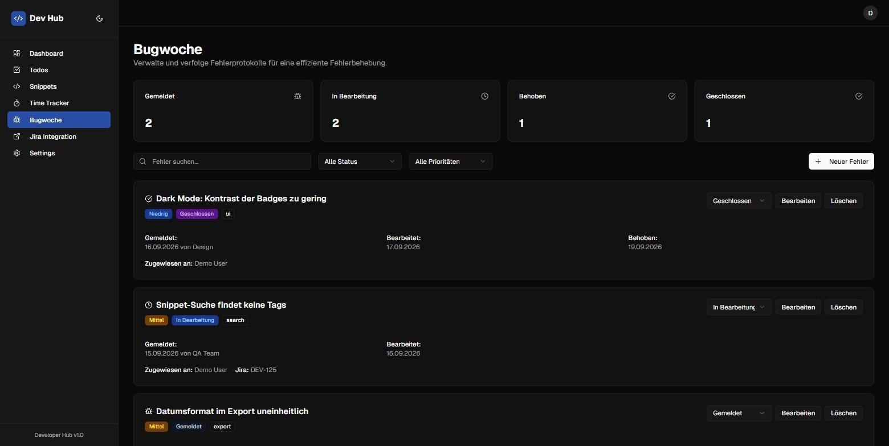
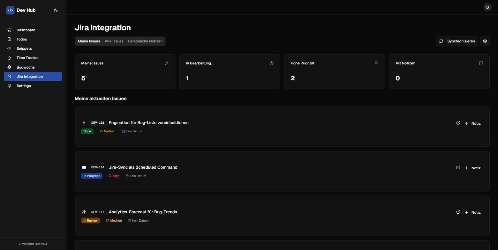

# Dev Hub API

REST-API für ein persönliches Developer-Dashboard: Code-Snippets, Todos, Bug-Tracking, Jira-Anbindung und Analytics an einem Ort.
Gebaut mit **Laravel 12** und einer Domain-Driven-Design-Struktur.

**Frontend:** [QuitScope/dev-hub-frontend](https://github.com/QuitScope/dev-hub-frontend) (Next.js 15, React 19, TypeScript)


| Code-Snippets | Bug-Tracking |
| --- | --- |
|  |  |

| Jira-Integration |
| --- |
|  |

> Die Screenshots zeigen das zugehörige Next.js-Frontend: [dev-hub-frontend](https://github.com/QuitScope/dev-hub-frontend).

---

## Funktionen

- **Snippets**: Code-Schnipsel mit Sprache, Tags und optionaler Jira-Verknüpfung. Volltextsuche über Titel, Beschreibung und Code.
- **Todos**: Aufgaben mit Kategorie (Private, Work, Learning), Priorität, Status und Fälligkeitsdatum.
- **Bugs**: Fehlerberichte mit Priorität (low bis critical), Status-Workflow (reported, in_progress, resolved, closed), Reporter und Assignee.
- **Jira**: Issues pro User über die Jira REST API synchronisieren, eigene Notizen zu Issues anlegen. API-Tokens werden verschlüsselt gespeichert.
- **Analytics**: Tägliche, wöchentliche und monatliche Snapshots, Zusammenfassungen, Trends und eine einfache Prognose.
- **Abfragen**: Filter, Sortierung und Pagination für Snippets, Todos und Jira-Issues über [spatie/laravel-query-builder](https://github.com/spatie/laravel-query-builder).
- **Auth**: Token-basiert mit Laravel Sanctum.

## Tech-Stack

| Bereich | Technologie |
| --- | --- |
| Framework | Laravel 12, PHP 8.2+ |
| Auth | Laravel Sanctum |
| Datenbank | SQLite (Standard), MySQL/PostgreSQL möglich |
| Abfragen | Spatie Query Builder |
| Tests | Pest / PHPUnit |
| Code-Stil | Laravel Pint |

## Architektur

Die Fachlogik ist von der HTTP-Schicht getrennt. Jeder Endpunkt ist ein Single-Action-Controller, Validierung läuft über Form Requests, Schreiboperationen über Actions.

```
src/
├── Domain/                 # Fachlogik, framework-nah aber HTTP-frei
│   ├── Actions/            # Use Cases (CreateBugAction, SyncJiraIssuesAction, …)
│   ├── Enums/              # Status, Prioritäten, Issue-Typen
│   ├── Models/             # Eloquent-Modelle
│   └── Exceptions/
├── Application/            # HTTP-Schicht, pro Modul
│   └── {Snippets,Todos,Bugs,Jira,Analytics}/
│       ├── Controllers/    # Single-Action-Controller
│       ├── Requests/       # Validierung
│       ├── Resources/      # API-Ressourcen
│       ├── Queries/        # Query-Builder-Definitionen
│       └── Filters/        # Eigene Filter
└── Support/
    └── Jira/               # Jira-Client und Mapping
```

## API

Die Routen haben kein `/api`-Präfix. Alle `/v1`-Routen brauchen einen Bearer-Token.

```
GET    /status

POST   /auth/register
POST   /auth/login
POST   /auth/logout
GET    /user

GET|POST            /v1/snippets
GET|PUT|DELETE      /v1/snippets/{id}

GET|POST            /v1/todos
GET|PUT|DELETE      /v1/todos/{id}

GET|POST            /v1/bugs
GET|PUT|DELETE      /v1/bugs/{id}

GET                 /v1/jira/issues
GET                 /v1/jira/issues/{id}
POST                /v1/jira/issues/sync
POST                /v1/jira/notes
PUT|DELETE          /v1/jira/notes/{id}
GET|PUT             /v1/jira/settings

GET                 /v1/analytics/summary
GET                 /v1/analytics/snapshots
GET                 /v1/analytics/trends
GET                 /v1/analytics/forecast
POST                /v1/analytics/recalculate
```

### Beispiele

```http
GET /v1/snippets?filter[search]=eloquent&filter[language]=php&sort=-created_at&limit=20
GET /v1/todos?page=2&limit=50
GET /v1/jira/issues?filter[issue_type]=Bug&sort=-jira_updated_at
```

```http
POST /auth/login
Content-Type: application/json

{ "email": "demo@devhub.test", "password": "password" }
```

Eine Postman-Collection liegt unter [`postman/`](postman).

## Lokal starten

```bash
git clone https://github.com/QuitScope/dev-hub.git
cd dev-hub
composer install
cp .env.example .env
php artisan key:generate
php artisan migrate
php artisan db:seed --class=DemoSeeder
php artisan serve
```

Der `DemoSeeder` legt Beispieldaten und einen Demo-User an (`demo@devhub.test` / `password`).

## Entwicklung

```bash
php artisan test        # Tests
composer lint           # Pint
```

Analytics-Snapshots werden per Artisan erzeugt:

```bash
php artisan analytics:generate-daily-snapshot
php artisan analytics:generate-weekly-snapshot
php artisan analytics:generate-monthly-snapshot
```

## Lizenz

MIT
